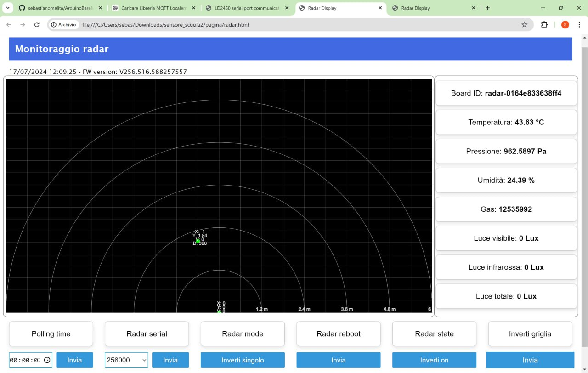

# ESP32 with Hi-Link HLK-LD2450 Radar

A school project to create a radar using ESP32, Adafruit LTR329 sensor, Hi-Link HLK-LD2450 radar and MicroPython.

The project is initially created by prof. Sebatiano Melita.

This project includes a web page for remote monitoring and control. This is a screenshot of the page:



A video of the web page in action is also available [here](https://drive.google.com/file/d/1KjS-0TWMNAd9SawNiWF4eYCHru64Aw-G/view?usp=sharing).

## Getting started

Remember to rename `config-example.py` into `config.py` and adjust the values according to your needs.


## **MQTT Messages**

### **Confirmed Messages**

The **confirmation** of messages sent by the receiver is normally not necessary in the case of **sensors**. In fact, if a sending by a sensor is not successful, it is useless to request the retransmission of data that will soon arrive with a more updated measurement.

Confirmation, on the other hand, is expected for **command** or **configuration** functions. For example, in the case of buttons, transit detectors or alarms in which the sending of the message occurs sporadically and in a completely **asynchronous** manner (i.e. not predictable by the receiver), it might be desirable to have feedback from the protocol through a confirmation mechanism based on **ack**. But this is not always possible.

**Confirmation**, however, could also be managed only by the **application layer** (not by the protocol) using a **feedback topic** (or state) to send the value of the current state immediately after it is affected by an incoming command on the device.

### **Definition of topic and payload**

Often, in the IP distribution network there is a server with the role of **MQTT broker** to which are associated:
- on a **measurement topic**:
- the **sensor** device is registered on the broker with the role of **publisher** because it wants to use this output channel to **send the measurements** to the **application server**
- the **application server** is registered as a subscriber because it is interested in receiving, on an input channel, the measurements of **all** sensors distributed in the network.
- on an **actuation topic (command)**:
- the **sensor** device is registered on the broker with the role of **publisher** because it wants to use this output channel to **send the command** to the actuator
- the **actuator** device is registered on the broker with the role of **subscriber** because it is interested in receiving, on an input channel, any actuation commands (motors, gates).
- on a **feedback topic (state)** (from the terminal device, to the broker), useful to the application server to receive confirmation of the actuator state change but also useful to the user to know the new state:
- the **actuator** device is registered on the broker with the role of **publisher** because it intends to use this output channel to **send feedback** with its state to a **display** associated with the command sensor.
- the **sensor** device, or better yet the **display** device associated with the sensor device (an LED or a screen), is registered on the broker with the role of **subscriber** because it is interested in receiving, on an input channel, any **feedback** on the actuator status to **show** them to the user. In this case, it is up to the user, and not the protocol, to **decide** whether and how many times to repeat the command, in case the device status is not yet the desired one.
- on a **configuration topic** where only the application server can publish while all other IoT devices are subscribers:
- both **sensor** devices and **actuator** devices register on the broker with the role of **subscriber** because they intend to use this **input** channel to receive **configuration commands** such as, for example, activation/deactivation, frequency of a measurement, duration of stand by, firmware updates via wireless (OTA mode), etc.
- the **application server** is responsible for defining the configuration settings and decides **which** to send and to **who**.

**In reality**, the configuration topic, while theoretically appropriate, could also be incorporated into the command topic, perhaps providing for a higher level of authorization than the commands related to ordinary functions.

### **Management of measurement topics**

We could now insert the temperature and pressure measurement into the more general topic of measurements that we will call ```measurements``` and register the living room temperature and presence sensor to the topic ```/living room/measurements``` as publisher, while we could register the management server to the topic ```+/measurements``` as subscriber of the measurements of all environments. The message could be the JSON

``` Json
{
"envSensor": {
"temp": 43,
"press": 1001,
"hum": 27.5,
"gas": 1400,
},
"deviceID": "01",
"timestamp": "2024-07-20T09:43:27",
}
```
If we wanted to select only one device, there are two alternative ways:
- insert the **mqtt prefix** of the device directly **in the path** ```/soggiorno/misure/mydevice1-98F4ABF298AD/{"envSensor": {....}}```
- insert an **id** of the device **in the JSON** ```/soggiorno/misure/{"deviceid":"01", "envSensor": {....},"deviceID": "01",}```, where ```01``` indicates a unique address only within the subgroup ```/living room/measurements```.

