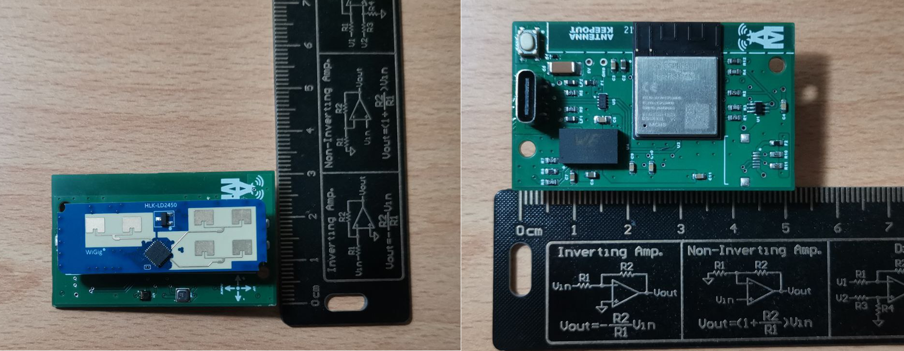

# Radar 24Ghz Esp32

A school project to create a radar using ESP32, Adafruit LTR329 sensor, Hi-Link HLK-LD2450 radar and MicroPython.

The project is initially created by prof. Sebatiano Melita.

This project includes a web page for remote monitoring and control. This is a screenshot of the page:

A video of the web page in action is also available [here](https://drive.google.com/file/d/1KjS-0TWMNAd9SawNiWF4eYCHru64Aw-G/view?usp=sharing).

An image of the board that collect all sensors, enviroment and radar sensors, is below:

The board is a prototype close to commercialization by the company Alemax of Ladispoli (RM) - Italy.

## Getting started

Remember to rename `config-example.py` into `config.py` and adjust the values according to your needs.

- [MQTT message management](mqtt_messages_logic.md)
- [JSON parser](json_parser.md)
