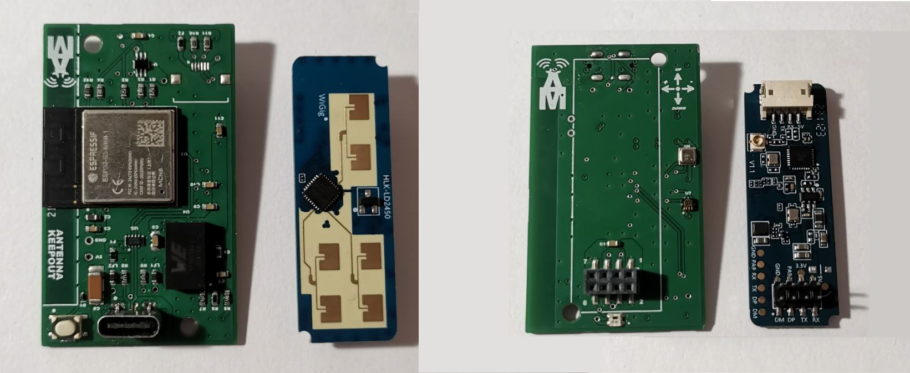
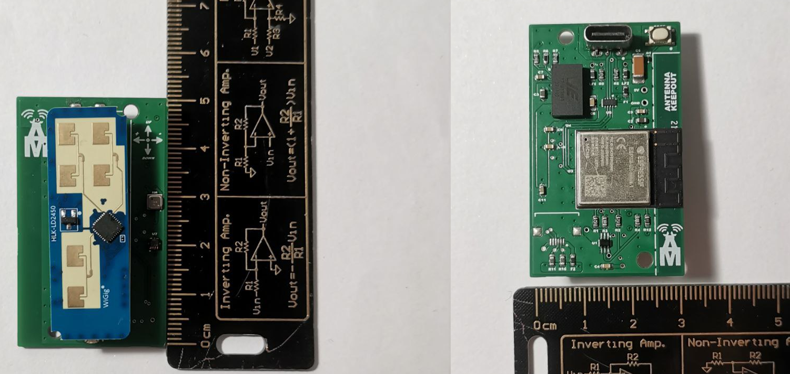

# Radar 24GHz Esp32

A school project to create a radar using ESP32, Adafruit LTR329 sensor, Hi-Link HLK-LD2450 radar and MicroPython.

The project is devoloped in collaboration by professors and students of the school IIS "G.Marconi" of Civitavecchia (RM) Italy for the aspect of the SW design and by a young startup, the Alemax company (RM) Italy, for the aspect of the board and elctronic design.

This project includes a web page for remote monitoring and control. This is a screenshot of the page:

A video of the web page in action is also available [here](https://drive.google.com/file/d/1KjS-0TWMNAd9SawNiWF4eYCHru64Aw-G/view?usp=sharing).

An image of the board that collects all sensors, environment and radar sensors is below:

The board is a prototype close to commercialization by the company Alemax of Ladispoli (RM) - Italy.

## Getting started

Rename `config-example.py` into `config.py` and adjust the values according to your needs.

- [Gestione dei messaggi MQTT](mqtt_messages_logic.md)
- [Parser JSON](json_parser.md)
- [Integrazione con EspHome](/esphome/esphome.md)
- [Integrazione con HomeAssistant](/HomeAssistant/homeAssistant.md)
